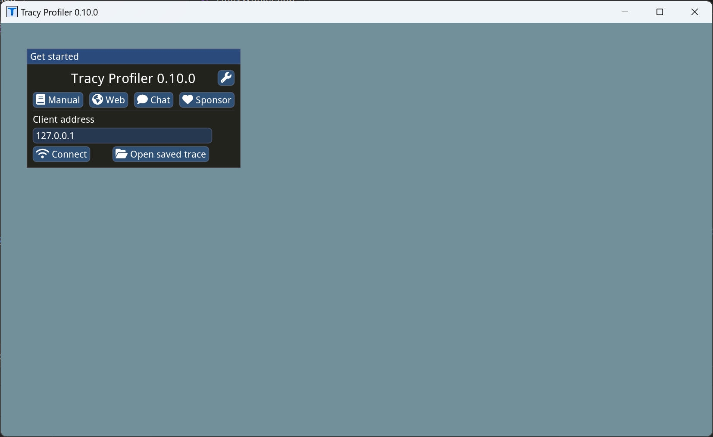
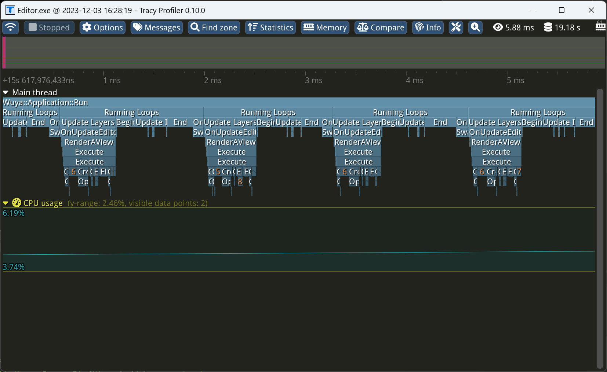

# Wuya

## 环境

- 安装[VulkanSDK](https://vulkan.lunarg.com/sdk/home#windows)（主要用来编译shader cache）
- CMake
- Visual Studio 2022

### Assimp库

assimp库中存在需要将`*.h.in`转换为`*.h`的情况，而premake并不支持类似于CMake的`CONFIGURE_FILE`功能，所以我们需要手动使用CMake生成assimp，build完成后，拷贝以下文件：

1. 将`"Wuya\Libraries\ThirdParty\assimp\build\include\assimp\config.h"`拷贝至`"Wuya\Libraries\ThirdParty\assimp\include\assimp\config.h"`
2. 将`"Wuya\Libraries\ThirdParty\assimp\build\contrib\zlib\zconf.h"`拷贝至`"Wuya\Libraries\ThirdParty\assimp\contrib\zlib\zconf.h"`
3. 将`"Wuya\Libraries\ThirdParty\assimp\build\revision.h"`拷贝至`"Wuya\Libraries\ThirdParty\assimp\revision.h"`

## 生成工程

- 使用git下载仓库，并更新所需的submodules；
- 执行`Win-GenProj.bat`来生成工程，打开`Wuya.sln`即可编译运行。

## 功能特性

- FrameGraph
- PBR
- Deferred Shading
- Tracy

## 使用Tracy

1. 先执行`Wuya\Libraries\ThirdParty\tracy\vcpkg\install_vcpkg_dependencies.bat`安装所需依赖；

2. 使用Visual Studio打开Tracy工程：`Wuya\Libraries\ThirdParty\tracy\profiler\build\win32\Tracy.sln`，并运行，点击connect启动监听；
   
   

3. 运行Editor，即可连接Tracy分析。
   
   