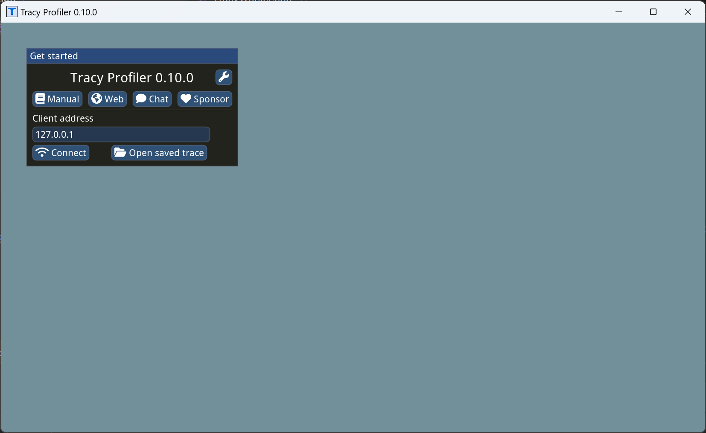
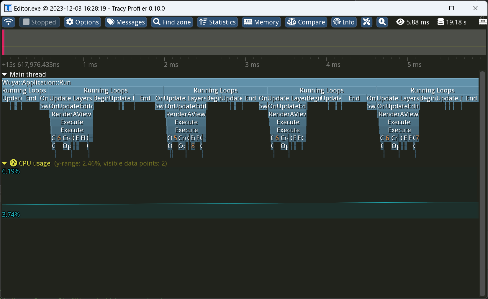

# Helios

## 环境

### 通用依赖

- CMake 3.20+
- Visual Studio 2017/2019/2022/2026（Windows）或 Xcode（macOS）

### Windows

- OpenGL（系统自带）

### macOS

- macOS 12.0 (Monterey) 或更高版本
- Xcode 13.0 或更高版本
- Metal框架（系统自带）

#### Metal C++ 环境配置

Helios引擎使用 **metal-cpp** 作为Metal后端的C++接口，无需额外安装，已作为子模块集成到项目中。构建前初始化所有子模块：

```bash
git submodule update --init --recursive
```

**配置要点：**

1. **头文件包含** - 项目已在CMakeLists.txt中配置metal-cpp路径：
   ```cmake
   ${CMAKE_SOURCE_DIR}/Libraries/ThirdParty/metal-cpp
   ```

2. **私有实现宏** - 在一个cpp文件中定义宏以链接Metal符号：
   ```cpp
   #define NS_PRIVATE_IMPLEMENTATION
   #define MTL_PRIVATE_IMPLEMENTATION
   #define CA_PRIVATE_IMPLEMENTATION
   
   #include "Metal/Metal.hpp"
   #include "QuartzCore/QuartzCore.hpp"
   ```

3. **框架链接** - CMake自动链接以下系统框架：
   - `Metal.framework` - Metal渲染API
   - `QuartzCore.framework` - Core Animation图层支持

4. **内存管理** - metal-cpp使用手动引用计数，遵循Cocoa内存管理规则：
   - `alloc`/`new`/`copy`/`Create` 开头的方法返回的对象需要手动释放
   - 可使用 `NS::SharedPtr<T>` 智能指针辅助内存管理

**支持的渲染API：**

| 平台 | 渲染后端 |
|------|----------|
| Windows | OpenGL |
| macOS | Metal (推荐), OpenGL |

> **注意**: macOS上推荐使用Metal后端以获得最佳性能。OpenGL后端在macOS上已被标记为deprecated。

## 生成工程

### 方式一：CMake构建（推荐）

使用CMake构建系统，自动处理所有依赖和配置文件：

**Windows:**
```bash
# 自动检测已安装的Visual Studio
Win-GenProj-CMake.bat

# 或手动指定VS版本
Win-GenProj-CMake.bat vs2022    # VS 2022
Win-GenProj-CMake.bat vs2019    # VS 2019
Win-GenProj-CMake.bat ninja     # Ninja
```

**macOS:**
```bash
chmod +x Mac-GenProj-CMake.sh
./Mac-GenProj-CMake.sh          # 生成Xcode工程
./Mac-GenProj-CMake.sh ninja    # 生成Ninja工程
```

**优势：**
- ✅ 无需手动配置assimp库
- ✅ 自动生成所需的config.h、revision.h、zconf.h等配置文件
- ✅ 跨平台支持（Windows/macOS/Linux）
- ✅ 支持多种生成器（Visual Studio、Xcode、Ninja、Makefiles等）

构建完成后，打开生成的工程文件即可编译运行：
- Windows: `build/Helios.slnx`

- macOS: `build/Helios.xcodeproj`


## 功能特性

- FrameGraph
- PBR
- Deferred Shading
- Tracy

## 使用Tracy

1. 先执行`Helios\Libraries\ThirdParty\tracy\vcpkg\install_vcpkg_dependencies.bat`安装所需依赖；

2. 使用Visual Studio打开Tracy工程：`Helios\Libraries\ThirdParty\tracy\profiler\build\win32\Tracy.sln`，并运行，点击connect启动监听；
   
   

3. 运行Editor，即可连接Tracy分析。
   
   